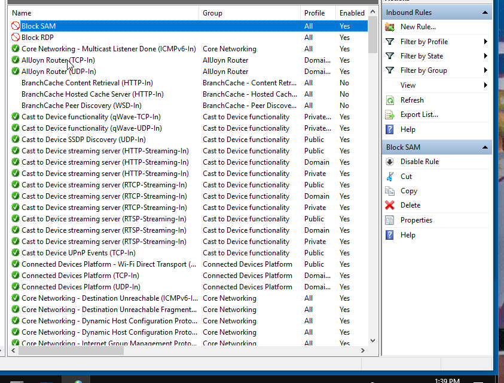

# Windows Defender Firewall and Advanced Security

<figure><figcaption></figcaption></figure>

Created a rule that when I access Sam's IP address, it will block my own IP address, hence stopping the connection. \
\
The lab was faulty since File and Printer Sharing - ICMP was not enabled not allowing us to ping one another. The RDP protocol is in affect as well when the IP rule is disabled, will not be able to RDP until l unblocking the RDP port.&#x20;
