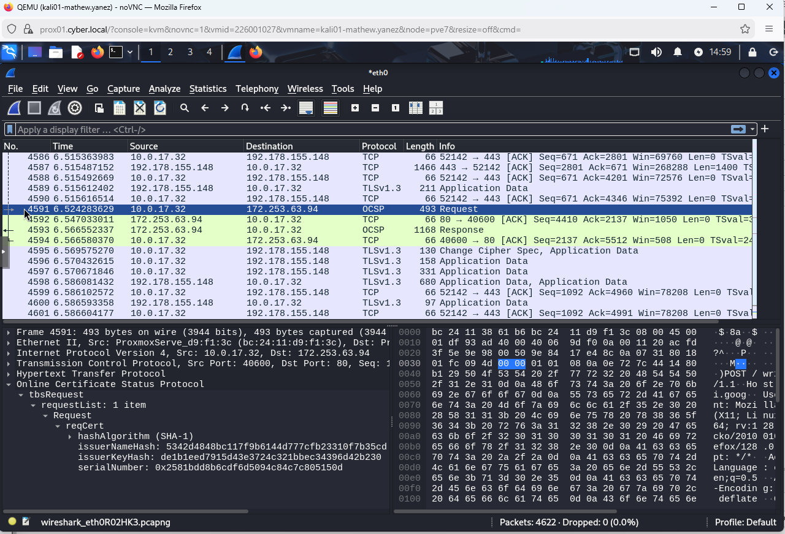
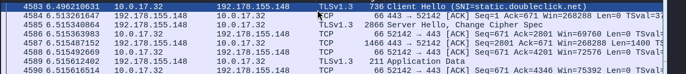
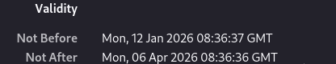
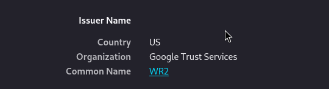
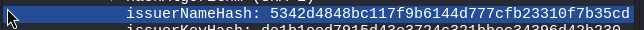
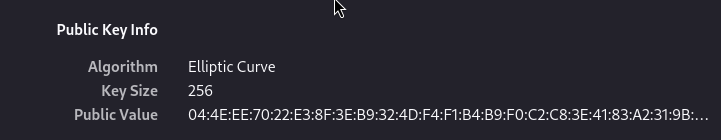
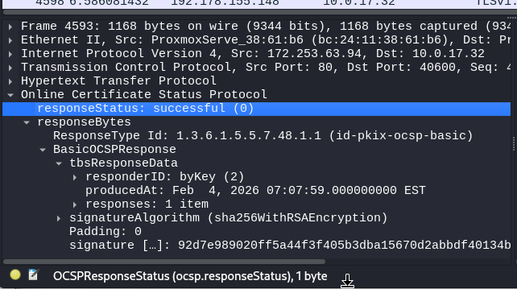

# Transport Layer Security (TLS) Lab Notes

<figure><figcaption></figcaption></figure>

Use Wireshark to capture a HTTPS session - make sure to start the capture before you load the page.

* Identify the packets that make up the TLS negotiation and certificate exchange:\
  **The Packets that make up the TLS exchange the request, TCP ACK, the Reponse and the following ACK from the source PC to the server. The 4 in green are the certificate packets.**&#x20;

<figure><figcaption></figcaption></figure>

<figure><figcaption></figcaption></figure>

The Following packets demonstrate the client Hello, and the Server Hello that take place beforehand.&#x20;

* validity date:

<figure><figcaption></figcaption></figure>

* certificate authority (issuer): **Under wireshark found the issuer name hash, found issuer name in the certificate.**

<figure><figcaption></figcaption></figure>

<figure><figcaption></figcaption></figure>

* public key

<figure><figcaption></figcaption></figure>

Below is a successful response from the OCSP Request.

<figure><figcaption></figcaption></figure>

