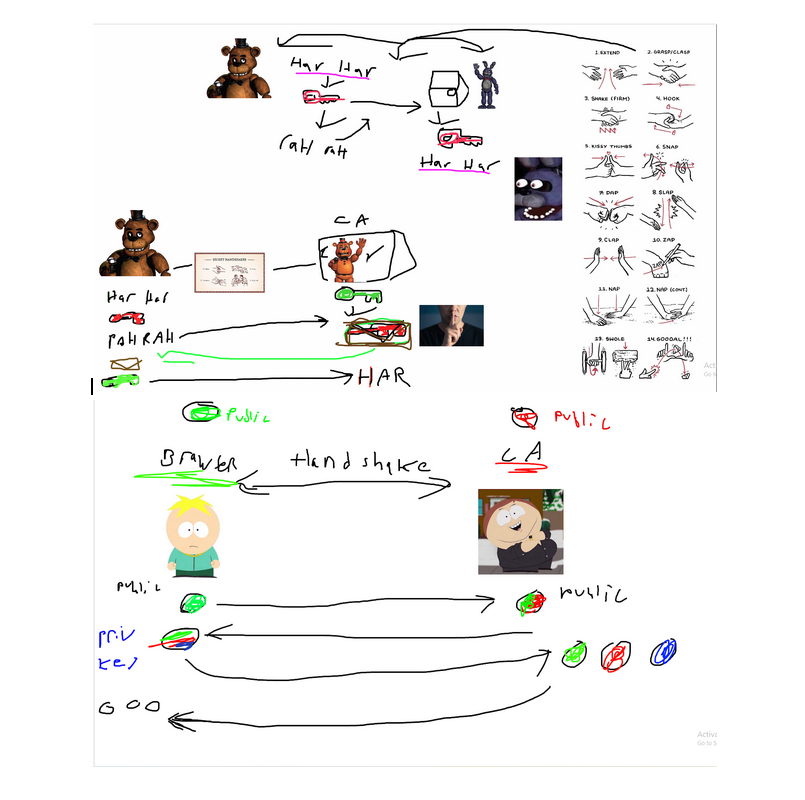

# What are CA Authority's?

Initial Thoughts on what a CA Authority looks like:

<figure><figcaption></figcaption></figure>

After speaking to Joe for about an hour about PKI, Diginoir, learned how client reaches out to web, web request a cert, CA stamps the web servers info and public address into a certificate with a digital signature from the CA attached (Private key encrypted which can be confirmed with public key), which is than sent to the client side with the web servers public key which allows for a bridge/connection to be made. Both sides guess a number until the bridge is made, where every 5000 packets the password can switch from fuzzykittens to fuzzypuppys. Technology is ever evolving so as decrypting technologies grow so do encrypting, for example WEP was cracked, hence new protocols are made.&#x20;
