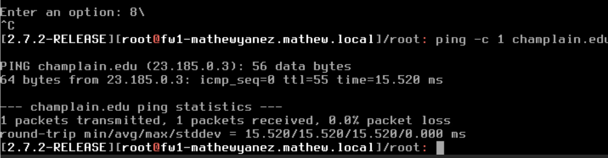

# 8/25/2026 Environment Setup

We opened pfsense, I set the WAN Adress to the assigned IP interface, mine was 10.0.17.113\
Make sure that the correct layer 2 connections are made, set adapters to correct virtual interfaces.

| Account              | WAN IP      |
| -------------------- | ----------- |
| aidan.giles          | 10.0.17.101 |
| aiden.shuman-gadbois | 10.0.17.102 |
| alpha.barry          | 10.0.17.103 |
| benjamin.polonsky    | 10.0.17.104 |
| benjamin.ware        | 10.0.17.105 |
| conor.cadorette      | 10.0.17.106 |
| drew.theberge        | 10.0.17.107 |
| ethan.bailey         | 10.0.17.108 |
| harrison.amaral      | 10.0.17.109 |
| jackson.bloch        | 10.0.17.110 |
| james.divalentino    | 10.0.17.111 |
| lillian.brasier      | 10.0.17.112 |
| mathew.yanez         | 10.0.17.113 |
| pietro.cervai        | 10.0.17.114 |
| riley.pitchard       | 10.0.17.115 |
| robinson.agresto     | 10.0.17.116 |
| ronan.jamieson       | 10.0.17.117 |
| ryan.sylvester       | 10.0.17.118 |
| samuel.mclamb        | 10.0.17.119 |
| samuel.royal         | 10.0.17.120 |

Deliverable 1:\
\

Getting this to work was odd. It didn't work, than I reset the router and it did, I believe I didn't press finish in the setup wizard so I had to manually do some things.

Deliverable 2:

<figure><figcaption></figcaption></figure>

This took me so much longer than it should have. I forgot to slick save when I turned on the DNS resolver, leading me to looking for different answers using traceroute, trying to figure out if somehow Google was being blocked since I was able to ping [champlain.edu](http://champlain.edu).

Deliverable 3:

I do not know why but the resolver crashed, I restart it and now I was able to access [Champlain.edu](http://champlain.edu)

.png>)\
\
Deliverable 4:\
.png>)

Whatever router sits after is blocking the request.\
\
Deliverable 5:  Consider this lab.  What technical terms or steps were you unfamiliar with?  Provide at least 3 examples (1 point).  Example:

 

1. I am not super familiar with running diagnostics and figuring out where packets are failing in a network. This was the first time I’ve had to use alot of tools to figure out where in DNS things were going wrong.&#x20;
2. While I have used Pfsense in the past, I am not familiar with all of its settings and configurations so the amount of changes I could make made some steps take longer as I wasn’t sure where in the process things were broken (hence diagnostics came in).
3. I have not worked this closely with DNS before and as such am a bit confused why different things are happening, one for example WHY DOES THE RESOLVER KEEP SHUTTING DOWN.&#x20;

I went back turns out I lied on deliverable 4, It can see the third one the resolver just shutdown before it got to it after refreshing it again I was able to get a response.&#x20;

 

The default gateway is the address the device relies on to reach addresses outside of the network. It is important because it is what allows a device to ping outside of its lan, and access the devices outside, or in general access the internet.&#x20;

 

Deliverable 6.  I believe this meets the guidelines with the screenshots and explanations.
